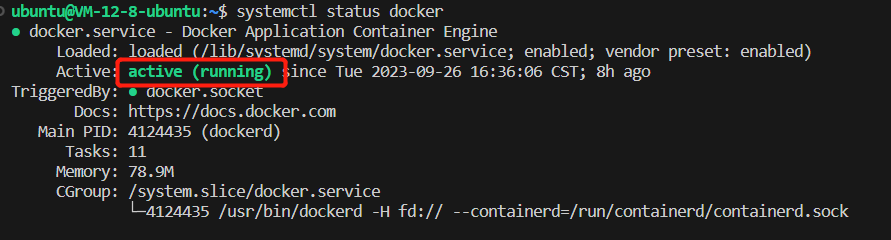
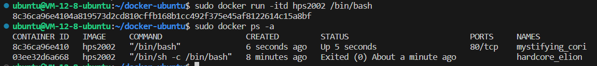
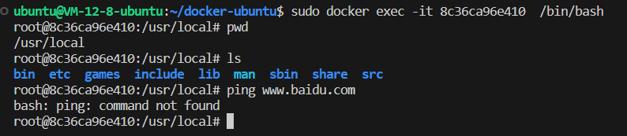
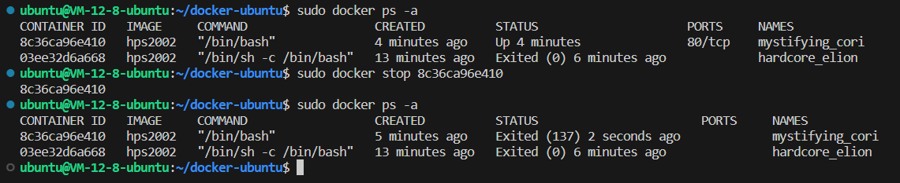
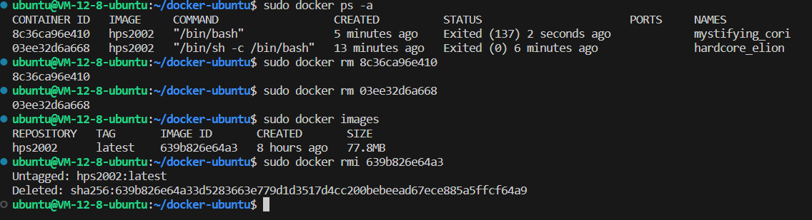

# Docker容器初尝试

安装Docker可以分为以下几个步骤：
- 安装
- 创建镜像
- 运行镜像

# 安装
```sh
sudo apt-get update # 更新软件包
sudo apt install apt-transport-https ca-certificates curl software-properties-common # 安装Docker依赖包：包括ca证书组件、软件提供组件
curl -fsSL https://download.docker.com/linux/ubuntu/gpg | sudo gpg --dearmor -o /usr/share/keyrings/docker-archive-keyring.gpg # 添加Docker的官方密钥
sudo apt install docker-ce docker-ce-cli containerd.io # 直接安装Docker
```

# 检查Docker的安装状态

```sh
sudo systemctl status docker # 使用systemctl直接管理Docker服务，此处可能Docker还未启动，因此我们直接对Docker进行启动
sudo systemctl start docker 
```

当出现下图中的 `active` 字样的说明 Docker 已经安装完成并且正在运行了。


# 创建第一个Docker容器

## 创建Dockerfile
创建一个Docker文件夹添加 `dockerfile` 

`dockerfile`
```dockerfile
# 指定镜像源
FROM ubuntu

MAINTAINER hps2002 youremail@qq.com

ENV  MYPATH  /usr/local
WORKDIR $MYPATH
 
# 创建时安装vim编辑器，也可以不安装，到时候启动之后在进去安装也可以
RUN sudo apt install vim
EXPOSE  80
  
CMD echo $MYPATH
CMD echo "-----end-----"
```

## 构建Docker image

执行命令 `sudo docker build -t hps2002 .` , 其中 `-t` 特性是指给创建的 `image` 命名，后面的 `.` 指的是在当前文件夹构建 `image` 的上下文。

成功之后如下图：


## 启动容器

`sudo docker run -itd <image_tag>/<image_id>` 命令可以启动容器。详细可以查看 `docker run --help`  
然后通过 `sudo docker ps -a` 查看是否启动成功



## 操作容器
通过 `docker exec ` 对容器进行操作  
现在我们直接进入shell界面  
`docker exec -itd hps2002 /bin/bash`  



## 停止容器

`sudo docker stop <container_id>`  



## 清除

清除顺序是：停止容器，删除容器，删除镜像

`sudo docker rm <container_id>`
`sudo docker rmi <image_id>`  




以上便是第一天接触Docker的记录，存在不正确的地方请通过 `issue` 指出