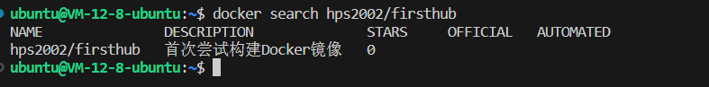
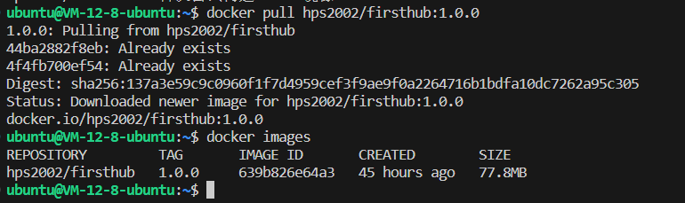
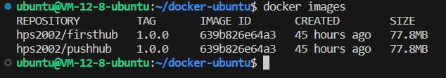
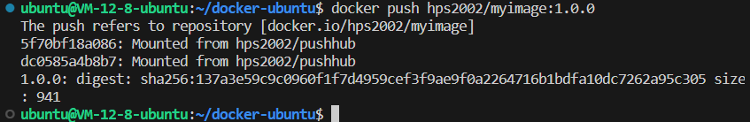

# 使用DockerHub进行容器仓库的存放以及拉取

在DockerHub上注册一个账号, 作为自己存放镜像的仓库。

对于DockerHub上拉取一个镜像的主要流程是:
- `docker search` 查找镜像
- `docker pull` 拉取镜像

## 拉取

对于一个已经存在的镜像，我们需要将其拉取到本地docker仓库的时候，先查询是否存在  
使用的是执行 `docker search <image_name>` 便会显示查找到的仓库名字

假设现在一个名字为 `hps2002` 的仓库有一个叫做 `firsthub` 的仓库，我们现在执行上述命令：

`docker pull hps2002/firsthub` 拉取镜像仓库到本地

## 上传

对于一个在本地已经制作好的一个镜像，想要将其传输到远程的镜像仓库上, 使用 `docker push <远程仓库名/镜像名:标签>` 

如下，我们已经制作好了一个名为：hps2002/myimage 的镜像仓库

执行 `docker push hps2002/myimage:1.0.0`

